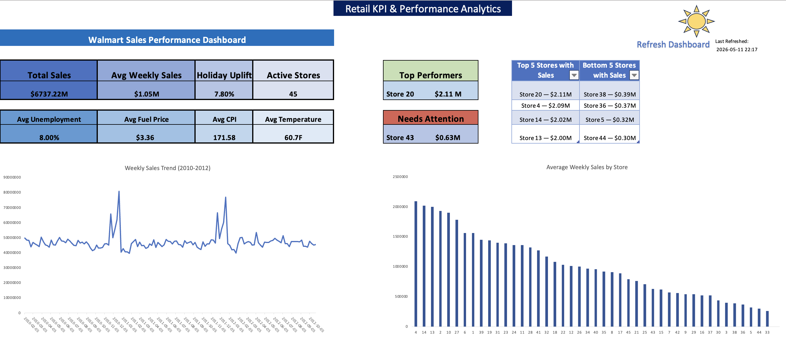
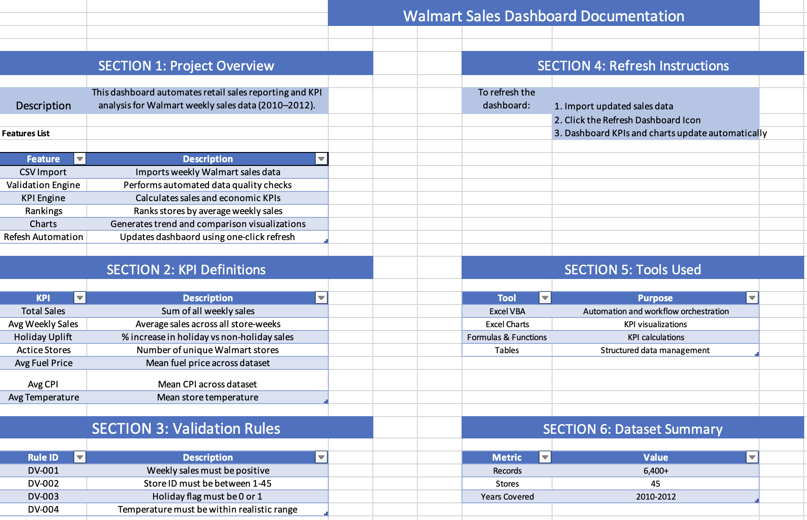
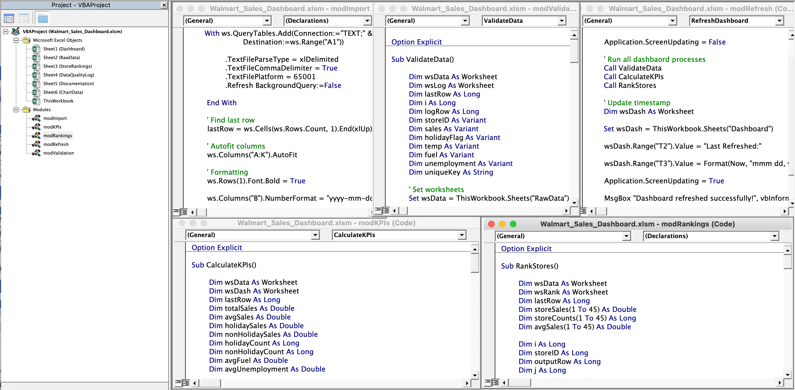

## Walmart Sales Dashboard (Excel VBA)
Overview

This project is an Excel VBA retail analytics dashboard built using Walmart weekly sales data (2010–2012). The dashboard automates KPI reporting, store performance analysis, validation workflows, and interactive dashboard refresh processes using modular VBA automation.

Features
- Automated CSV import workflow
- Data validation engine with rule-based checks
- KPI calculation automation
- Store performance rankings
- Interactive dashboard refresh control
- Trend and comparative sales visualizations
- Executive performance insights
- Documentation and workflow tracking
- Dashboard Preview
- Main Dashboard

## Dashboard Preview

### Main Dashboard

## Documentation Sheet

## VBA Architecture

- KPI Metrics
- Total Sales
- Average Weekly Sales
- Holiday Uplift
- Active Stores
- Average Fuel Price
- Average CPI
- Average Temperature
- Average Unemployment
  
Validation Rules
- DV-001: Weekly sales must be positive
- DV-002: Store ID must be between 1 and 45
- DV-003: Holiday flag must be 0 or 1
- DV-004: Temperature must remain within a realistic range

Tools Used
- Excel VBA
- Excel Charts
- Formulas & Functions
- Structured Tables
- Git & GitHub

Dataset Summary
- 6,400+ weekly sales records
- 45 Walmart stores
- Coverage period: 2010–2012
- Refresh Workflow

The dashboard includes a one-click refresh workflow that:

Validates raw sales data
Recalculates KPIs
Updates store rankings
Refreshes charts and dashboard outputs
Updates dashboard timestamps
